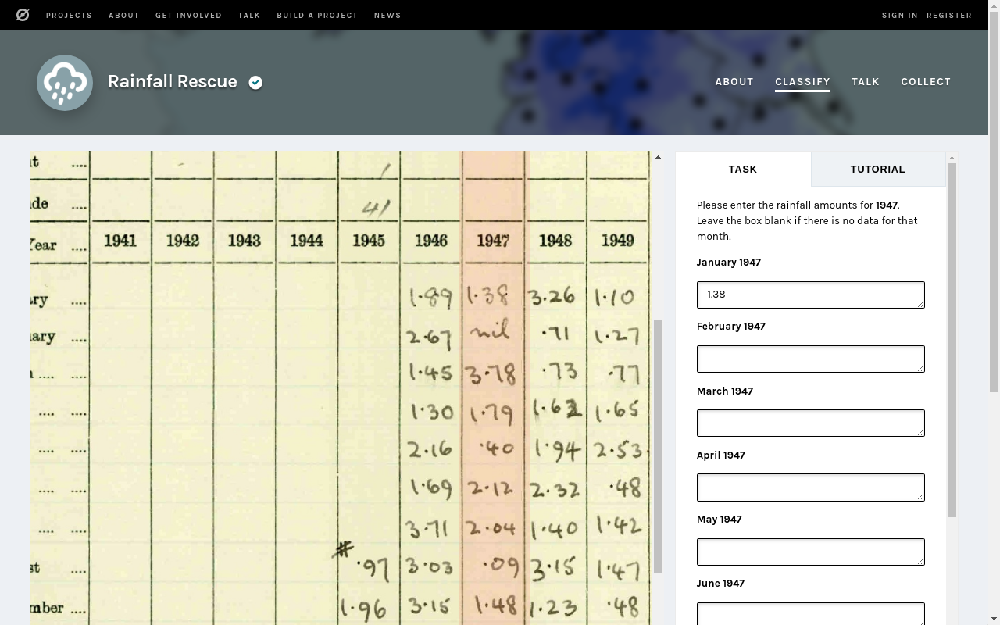

# Rainfall Rescue Tools Chrome Extension

A Chrome extension to add improved layout and tools to the classify page of the [Rainfall Rescue](https://www.zooniverse.org/projects/edh/rainfall-rescue) project.

Get it from the Chrome Web Store at https://chrome.google.com/webstore/detail/rainfall-rescue-tools/ajnjpkijppomillonhioeelpjogaaalf

## Features

The Rainfall Rescue project is currently trying to digitize thousands of historic, hand-written rainfall records. 

This Chrome extension modifies the project's classify page to help make transcription easier and less error-prone. It adds the following features:

- Vertical scrollbars on the image viewer and input boxes. This allows the image and the inputs to be aligned as you wish.

- A vertical 'ruler' to highlight the column being transcribed. Use the horizontal scrollbar on the image viewer to move the column under the highlighter.

- A modified 'Finished' / 'Already seen' warning banner. The banner appears more prominently across the middle of the image.

- A calculated total of rainfall values entered. This can be compared to the total on the sheet to check for transcription errors.

- Key bindings so that the `Enter` key can be used to move to the next input box, and finally to the 'Done' button.

A major advantage of the scrollbars is that they maintain their positions when the next image is loaded.

## Usage

Simply install the extension from the [Chrome Web Store](https://chrome.google.com/webstore/detail/rainfall-rescue-tools/ajnjpkijppomillonhioeelpjogaaalf). Navigate to the Rainfall Rescue classify page (or reload it) and the extension will be activated automatically. 

### Calculated Rainfall Total

The total appears at the end of the label of the total rainfall box e.g. 'Total for 1910 (calculated: 23.45)'. It updates each time you move to the next input box.

### Key Bindings

The `Enter` key can be used to move from one input box to the next. On the last input box the `Enter` key moves directly to the 'Done' button (unlike the `Tab` key).

## Information

This Chrome extension is not an official part of the Rainfall Rescue project.

## License

[MIT license](LICENSE).
